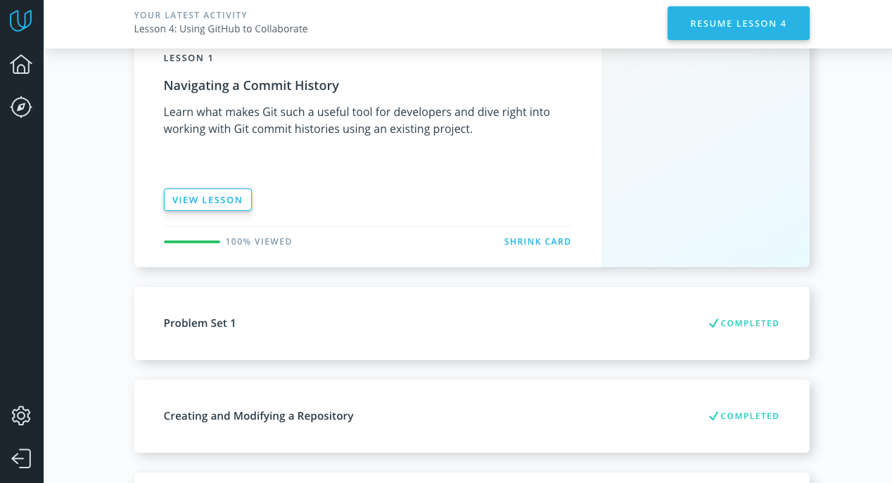

<h2>

```diff
+ Git Collaboration +
```
</h2>

### New for me from passed materials:

* I eventually got how to add forgotten files to commit (git commit --amend)
* Realized the difference between git fetch git pull. 

 
---------------------------------------------------------------------------------------


