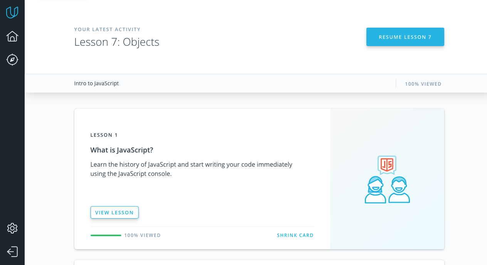
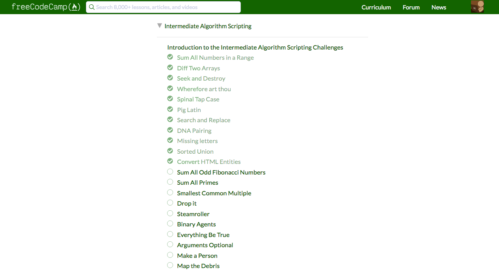

<h2>

```diff
+ JS Basics+
```
</h2>

### I've repeated Array.prototype.methods.It was very useful for me.



---------------------------------------------------------------------------------------



---------------------------------------------------------------------------------------

<h2>